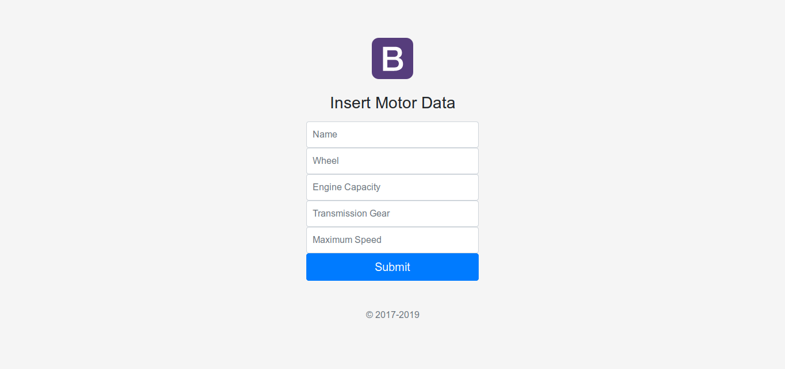
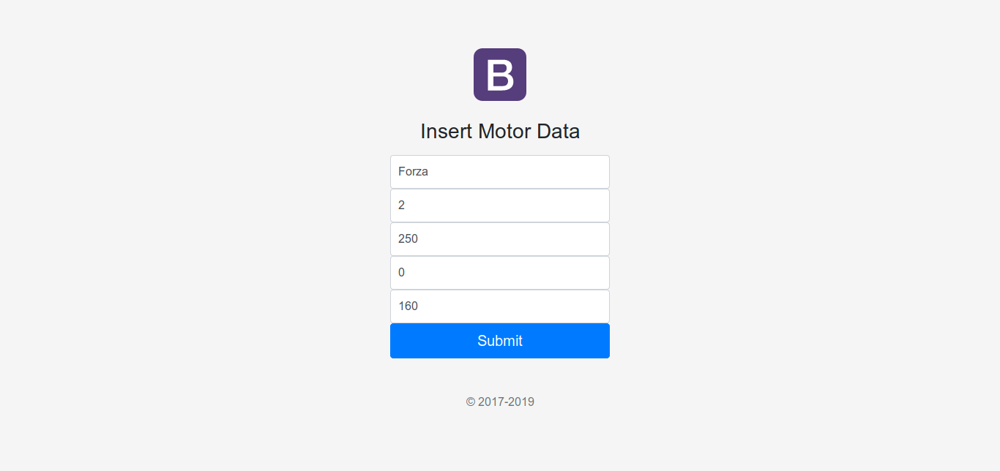
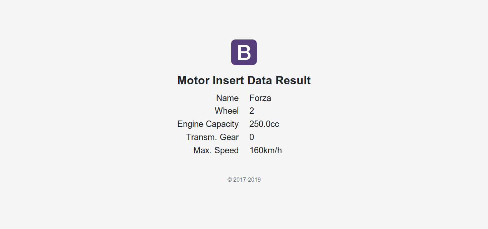

# Tugas 2
1. Deskripsi Singkat  
Aplikasi pada tugas 2 ini bernama JSP. JSP memiliki 3 halaman yaitu
    1. index index.jsp  
    [localhost:8080/JSP/](localhost:8080/JSP/)
    2. form entry form.jsp  
    [localhost:8080/JSP/showForm](localhost:8080/JSP/showForm)
    3. output motorView.jsp  
    [localhost:8080/JSP/addVehicleMotor](localhost:8080/JSP/addVehicleMotor)  
    
    Halaman dibuat menggikuti [tutorial](https://www.baeldung.com/spring-mvc-form-tutorial). Resources pada halaman berupa css dan image terdapat pada folder /resources dan diload menggunakan [ResourceResolver](https://www.baeldung.com/spring-mvc-static-resources).  
    Pada form entry, pengguna diminta untuk memasukkan data berikut
    - name
    - wheel
    - engineCapacity
    - transmissionGear
    - maxSpeed
    
    Setelah pengguna menekan tombol Submit, data akan langsung ditampilkan pada halaman output
2. Screenshot Form Entry  
    
    
3. Screenshot Output  
    
